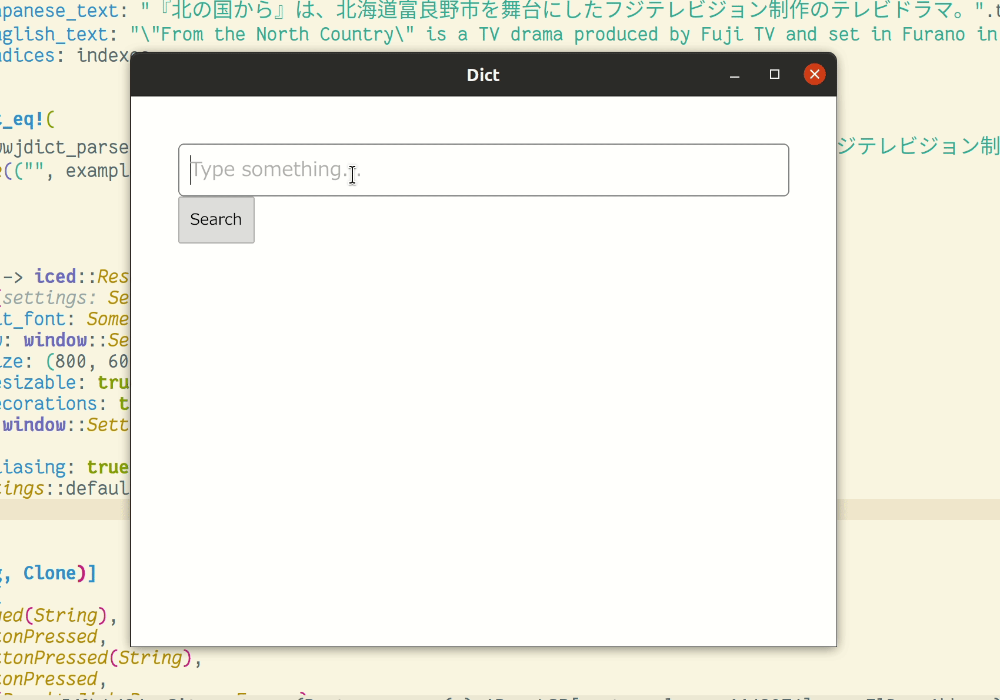
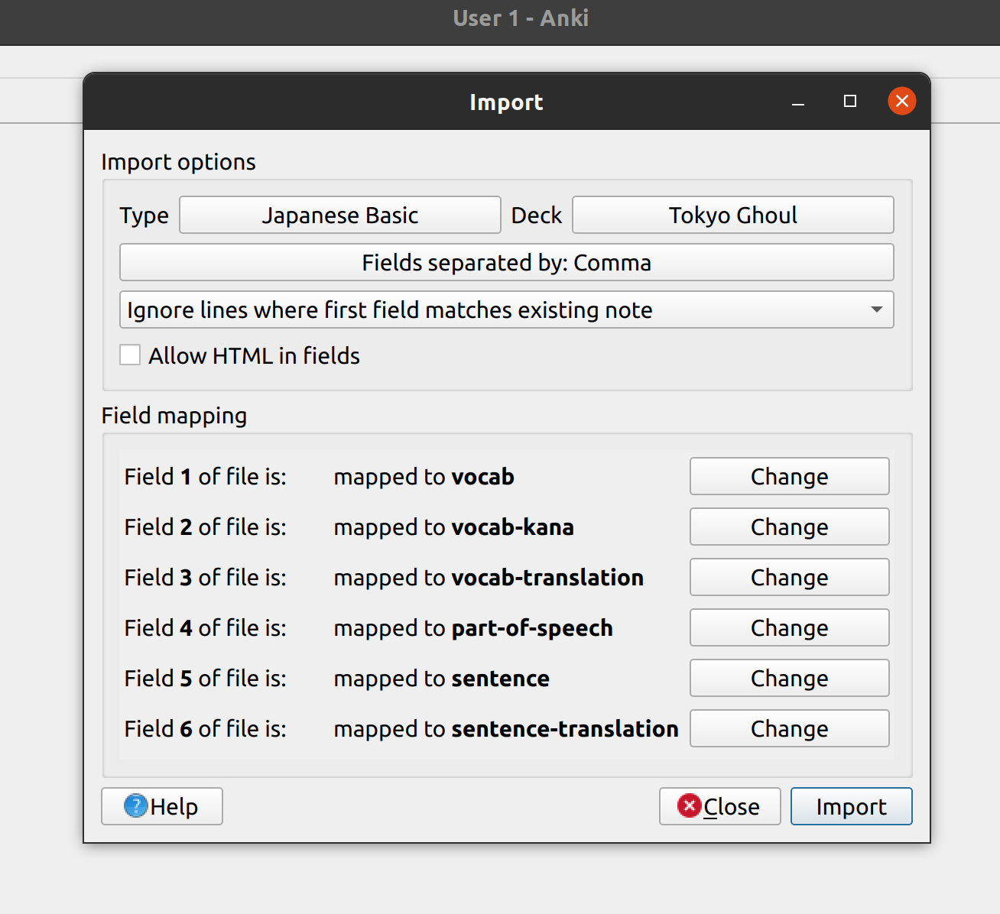

**Dictionary**

A desktop application to look up english/japanese words and sentences.  

Uses the fantastic [jisho.org](https://jisho.org) search api, and example sentences from the [Tatoeba project](http://tatoeba.org/home).  

Written in [Rust](https://www.rust-lang.org/), using [Iced](https://docs.rs/iced/0.3.0/iced/): a cross-platform GUI library focused on simplicity and type-safety. Inspired by Elm.  

**Generating Anki flash cards**

This is what I use this application for primarily. Simply click the button "Save Anki Flashcard" on the Kanji detail page.  
It will create a csv file called 'japanese\_words\_anki_import.txt', which you can load into Anki using the import button.  

You must create a "Note type" so that that the fields can be put in the right positions. I created one called Japanese Basic and it looks like this:  

See the official documentation on Anki importing at https://docs.ankiweb.net/importing.html.
