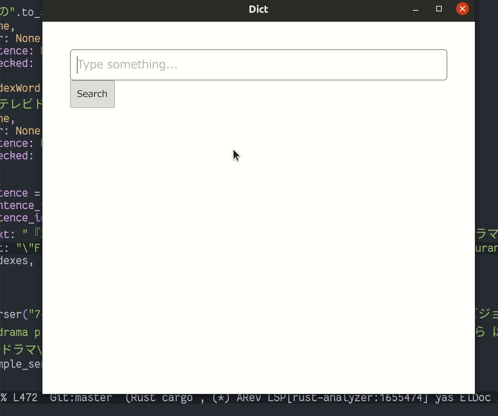

**Dictionary**

A desktop application to look up english/japanese words and sentences.  

Uses the fantastic [jisho.org](https://jisho.org) search api, and example sentences from the [Tatoeba project](http://tatoeba.org/home).  

Written in [Rust](https://www.rust-lang.org/), using [Iced](https://docs.rs/iced/0.3.0/iced/): a cross-platform GUI library focused on simplicity and type-safety. Inspired by Elm.  

**Where/how to get example sentences**

TODO: Explain how to get wwwjdict sentences file. (~30 mb)
